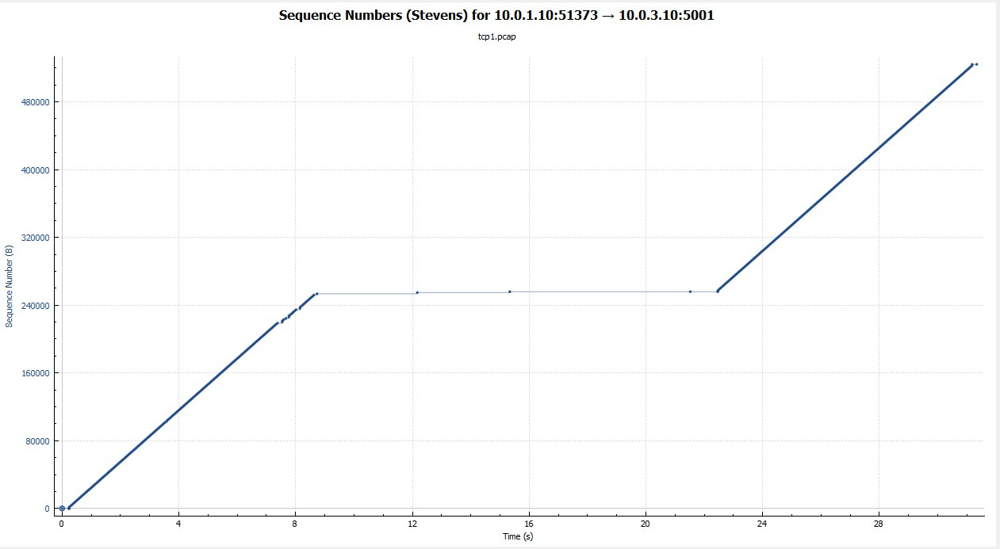

<u>Grupo A</u>

<u>Práctica/Laboratorio de TCP</u>

 Amoroso, Lihuel Pablo 13497/2; Gasquez, Federico Ramón 13598/6

Para la captura dada analizar con el siguiente cuestionario utilizando una herramienta como wireshark.

1. Cuántos intentos de conexiones TCP hay en la captura?

    Hay un intento exitoso.

2. Cuales son la fuente y el destino (IP:port) para c/u?

    Para el único intento exitoso, la fuente es 10.0.1.10 y el destino es 10.0.3.10.

3. Cuántas conexiones TCP exitosas hay en la captura? Cómo se identifican las exitosas de las no exitosas, que flags se encuentran en estas?

    Hay una conexión exitosa. Una conexión exitosa se diferencia de otra que no lo es en cómo se desarrolla la conexión. Para establecer una conexión exitosa en TCP son necesarios tres pasos(el también llamado _three-way handshake_):
    1. SYN: La apertura activa es realizada por el cliente enviando un SYN al servidor. El cliente establece el número de secuencia del segmento a un valor aleatorio, supongamos A.
    2. SYN-ACK: en respuesta, el servidor responde con SYN-ACK. El número de confirmación es establecido en uno más que el número de secuencia recibido, en este caso, A+1, y el número de secuencia que el servidor elige para el segmento es otro número aleatorio, llamémoslo B.
    3. ACK: finalmente, el cliente envía un ACK al servidor. El número de secuencia es establecido según el valor de confirmación, en este caso, A+1, y el valor de confirmación es establecido a uno más que el número de secuencia recibido, en nuestro caso, B+1.

    Ese es el desarrollo de una conexión exitosa. Una conexión fallida se puede reconocer a simple vista por el flag **RST** que indica el reinicio de la conexión cuando falla el intento.

Dada la primera exitosa responder:

4. Quién inicia la conexión, quien sería el servidor y quién el cliente? Qué flags se ven activados? En que segmentos se ve el 3-way hand-shake?

    La IP que inicia la conexión es la 10.0.1.10. Esta misma IP es el cliente dado que es la única que *pushea* datos. La IP 10.0.3.10 se limita solo a recibirlos, por lo que solo actúa de servidor.

5. Qué ISNs se intercambian?

    El ISN de 10.0.1.10 es 3436242234, el de 10.0.3.10 es 2219352712.

6. Qué opciones se negocian. Qué significa c/u? Cuál es el MTU negociado?

    Las opciones que se negocian son las siguientes:
    
    * Maximun Segment Size
    
        El tamaño máximo de segmento (MSS) es la máxima cantidad de datos, especificada en bytes, que TCP está dispuesto a recibir en un solo segmento. Para obtener el mejor rendimiento, el MSS debe configurarse lo suficientemente pequeño para evitar la fragmentación de IP, lo que puede llevar a la pérdida de paquetes y retransmisiones excesivas. Para tratar de lograr esto, generalmente el MSS es anunciado por cada lado, utilizando la opción MSS, cuando se establece la conexión TCP, en cuyo caso se deriva del tamaño de la unidad de transmisión máxima(_Maximum Transfer Unit_, MTU) de la capa de enlace de datos de las redes a las que el emisor y el receptor están directamente conectados. Además, los remitentes de TCP pueden usar la técnica de _Path MTU Discovery_ (PMTUD) para inferir la MTU mínima a lo largo de la ruta de red entre el remitente y el receptor, y usar esto para ajustar dinámicamente el MSS para evitar la fragmentación de IP dentro de la red.

        El anuncio de MSS también se suele llamar "negociación de MSS". Estrictamente hablando, el MSS no se "negocia" entre el emisor y el receptor, porque tal afirmación implicaría que éstos negociarán y acordarán un MSS único y unificado que se aplique a todas las comunicaciones en ambas direcciones de la conexión. Esto no es así, ya que, en una conexión TCP, los valores podrían ser completamente distintos e independientes para las dos direcciones del flujo de datos. Esta situación puede surgir, por ejemplo, si uno de los dispositivos que participan en una conexión tiene una cantidad extremadamente limitada de memoria reservada(quizás incluso más pequeña que la MTU promedio descubierta con el PMTUD) para procesar los segmentos TCP entrantes.
        
    * SACK

        Confiar exclusivamente en el esquema de ACK acumulativo empleado por el protocolo TCP original puede provocar ineficiencias cuando se pierden paquetes. Por ejemplo, suponga que los bytes con el número de secuencia 1.000 a 10.999 se envían en 10 segmentos TCP diferentes de igual tamaño, y el segundo segmento(números de secuencia 2.000 a 2.999) se pierde durante la transmisión. En un protocolo de ACK acumulativo puro, el receptor solo puede enviar un valor ACK acumulativo de 2,000(el número de secuencia inmediatamente después del último número de secuencia de los datos recibidos) y no puede decir que recibió los bytes 3,000 a 10,999 con éxito. Por lo tanto, es posible que el remitente tenga que reenviar todos los datos a partir del número de secuencia 2,000.

        Para solucionar este problema, TCP emplea la opción de reconocimiento selectivo (_Selective Acknowledgement_, SACK), definida en 1996 en la RFC 2018, que le permite al receptor reconocer bloques discontinuos de paquetes que se recibieron correctamente, además del número de secuencia inmediatamente después del último número de secuencia del último byte contiguo recibido sucesivamente, como en el reconocimiento TCP básico. El ACK puede especificar un número de bloques SACK, donde cada uno de ellos es transportado por el _Borde Izquierdo del Bloque_(el primer número de secuencia del bloque) y el _Borde Derecho del Bloque_(el número de secuencia inmediatamente después del último número de secuencia del bloque), con un _Bloque_ que es un rango contiguo que el receptor recibió correctamente. En el ejemplo anterior, el receptor enviaría un segmento ACK con un valor ACK acumulativo de 2,000 y un encabezado de opción SACK con números de secuencia 3,000 y 11,000. En consecuencia, el remitente solo retransmitiría el segundo segmento con números de secuencia de 2,000 a 2,999.

        Un remitente de TCP puede interpretar una entrega de segmento fuera de orden como un segmento perdido. Si lo hace, el remitente de TCP retransmitirá el segmento anterior al paquete fuera de orden y reducirá la velocidad de entrega de datos para esa conexión. La opción de SACK duplicado(_duplicate-SACK_), una extensión de la opción de SACK que se definió en mayo de 2000 en RFC 2883, resuelve este problema. El receptor TCP envía un D-ACK para indicar que no se perdieron segmentos, y el remitente TCP puede restablecer la tasa de transmisión más alta.

        La opción SACK no es obligatoria, y entra en operación solo si ambas partes la apoyan. Esto se negocia cuando se establece una conexión. SACK usa una opción de encabezado TCP. El uso de SACK se ha generalizado: todas las pilas TCP populares lo admiten.

    * Timestamps

        Las marcas de tiempo(_timestamps_) TCP, definidas en RFC 1323 en 1992, pueden ayudar a TCP a determinar en qué orden se enviaron los paquetes. Las marcas de tiempo de TCP normalmente no están alineadas con el reloj del sistema y comienzan con algún valor aleatorio. Muchos sistemas operativos incrementarán la marca de tiempo por cada milisegundo transcurrido; sin embargo, el RFC solo establece que los ticks deben ser proporcionales.

        Hay dos campos de marca de tiempo:

        + Un valor de marca de tiempo del remitente(_sender timestamp_) de 4 bytes (mi marca de tiempo)
        + Un valor de marca de tiempo de respuesta del receptor(_echo reply timestamp_) de 4 bytes (la marca de tiempo más reciente recibida).

        Las marcas de tiempo de TCP se utilizan en un algoritmo conocido como Números de protección contra secuencia envuelta, o PAWS(Protection Against Wrapped Sequence numbers). PAWS se usa cuando la ventana de recepción cruza el límite del número de secuencia. En el caso de que un paquete se haya retransmitido potencialmente, responde a la pregunta: "¿Es este número de secuencia en los primeros 4 GB o en el segundo?" Y la marca de tiempo se utiliza para romper el empate.

        Además, el algoritmo de detección de Eifel(RFC 3522) utiliza marcas de tiempo de TCP para determinar si se están produciendo retransmisiones porque los paquetes se pierden o simplemente están fuera de servicio.
    
    * No-Operation(NOP)

        La opción NOP significa "Sin opción" y se utiliza para separar las diferentes opciones utilizadas dentro del campo Opción en el segmento TCP. La implementación del campo NOP depende del sistema operativo utilizado. Por ejemplo, si se usan las opciones MSS y SACK, Windows XP usualmente colocará dos NOP entre ellas. Por ́último, debemos tener en cuenta que la opción NOP ocupa 1 byte. En nuestro ejemplo, ocuparía 2 bytes ya que se usaría dos veces.

    * Windows Scaling

        Para un uso más eficiente de las redes de alto ancho de banda, se puede usar un tamaño de ventana TCP más grande. El campo de tamaño de la ventana TCP controla el flujo de datos y su valor está limitado a entre 2 y 65,535 bytes.

        Como el campo de tamaño no se puede expandir, se usa un factor de escala. La opción de ventana escalable(_windows scaling_), como se define en la RFC 1323, es una opción que se utiliza para aumentar el tamaño máximo de la ventana de 65,535 bytes a 1 gigabyte. La ampliación a tamaños de ventana más grandes es una parte de lo que es necesario para el ajuste de TCP.

        La opción de escala de ventana se usa solo durante el protocolo de tres vías o _three-way handshake_. El valor de ventana escalable representa el número de bits para desplazar a la izquierda el campo de tamaño de ventana de 16 bits. El valor de ventana escalable se puede establecer de 0(sin cambio) a 14 para cada dirección independientemente. Ambos lados deben enviar la opción en sus segmentos SYN para habilitar el escalado de la ventana en cualquier dirección.

    El MTU se calcula del siguiente modo:

        MTU = IP Header length + TCP header length + Data length

    Por lo tanto, en nuestro caso:

        MTU = 20 bytes + 40 bytes + 1460 bytes

        MTU = 1520 bytes

7. Quién es el que envía la mayor cantidad de datos (IP:port)?

    El que envía datos es el cliente (10.0.1.10:51373)

8. Identificar primer segmento de datos (origen, destino, tiempo, númerode fila y número de secuencia TCP).

    Origen: 10.0.1.10, destino: 10.0.3.10, tiempo: 0.234507, fila: 4, número de secuencia: 1

    * Cuántos datos lleva?

        Se envı́an datos de 24 bytes.

    * Cúando es confirmado?(tiempo, número de fila y número de secuencia TCP)?
    
        Los datos se confirman en el segmento de fila 5, tiempo 0.234601 y número de secuencia 1.
    
    * La confirmación, qué cantidad de bytes confirma?
    
        Se confirman 24 bytes. Esto se obtiene del numero de ACK (Secuencia anterior + bytes confirmados).  
        Siendo el valor de ACK = 25  y el anterior numero de secuencia = 1, podemos calcular que se confirma la recepción de 24 bytes.

9. Control de Flujo:

    1. Se activa en algún momento el mecanismo de control de flujo?

        Si, se puede apreciar en el segmento 280 en el que la ventana se llena.

    2. Indicar donde(tiempo, número de fila y número de secuencia TCP) y a que se debe?

        En el segmento 280, a los 12.168621 segundos, con número de secuencia absoluto 3436497107(y relativo 254873) dado que se llenó la ventana. Esto se produce cuando el emisor envía más datos de los que el receptor llega a procesar. El receptor siempre se limita a enviar su tamaño de ventana. Eventualmente, el tamaño será lo suficientemente bajo, y cuando el emisor envíe ese tamaño, que es mayor a lo que soporta la ventana del receptor, marcará con un flag(Window Full) que indica que la ventana está llena y que no puede enviar tantos datos como quisiera. El receptor solo recibirá la parte que puede guardar en su ventana, el resto se perderá. En los próximos segmentos, el receptor se limitará a informar al emisor que la ventana está en 0 mediante el flag ZeroWindow, y el emisor se limitará a esperar y enviará el flag keep-alive. Cuando la ventana vuelve a abrirse, el receptor envía el flag Window Update y el emisor vuelve a enviar la data que le quedó pendiente cuando la ventana se había llenado y la comunicación continúa.

    3. Cuánto tiempo parece durar?

        Dura 10.142373‬ segundos, desde el segmento 280 hasta el 286 en el que la ventana vuelve a tener espacio.

    4. Cuál es el numero de ventana que desactiva el mismo?

        En el segmento 279, se puede apreciar que el receptor envía un tamaño de ventana de 64. Lo que ocurre luego es que el emisor intenta enviar 1024 bytes cuando el tamaño de ventana es solo 64, por lo que se envian solo 64 y el emisor marca que la ventana se ha llenado. Los próximos segmentos del receptor traerán seteado el flag ZeroWindow mientras la ventana permanezca llena.

    5. Qué otros datos se pueden obtener?

        Que el receptor no procesa tan rápido como el emisor envía y que: o bien, el emisor envíe menos datos para que la ventana no se llene; o bien, el receptor aumente el tamaño de su ventana para evitar que se llene tan rápido.

10. Control de congestión:
    1. Se encuentra en la red indicios de control de congestión?
    
        No se observan indicios del control de congestión en la captura.

    2. Cómo se detectan? Indicar número de segmento perdido.

        Cuando hay mas de 3 RST seguidos, esto indica que se produce congestión. 
    No puedo indicar un número de segmento perdido, dado que no se activa en ninguna parte de la captura.

    3. En que momento se ve la primera retransmisión? 
    
        No se observan restransmisiones en la captura.

    4. Cuántos segmentos se re-transmiten?

        No se observan restransmisiones en la captura.

11. Quién inicia el cierre de la conexión? Qué flags se utilizan? En que segmentos se ve ésta(tiempo, número de fila y número de secuencia TCP)

    El emisor de la conexión inicia el cierre en el segmento 603, a los 31.177540 segundos, enviando el flag FIN y pusheando los últimos datos restantes. El receptor recibe la petición de FIN, los datos y envía al emisor también un FIN para indicar el cierre de ese extremo. Luego, el emisor recibe el FIN y envía un ACK y se cierra la conexión.

12. El RTT entre que valores oscila?

    El Round Time Trip oscila entre valores muy cercanos al 0 y 233. 
    

13. El BW digital alcanzado, cual parece ser?

    El bandwidth suele ser de 255000 bits/s, excepto cuando se llena la ventana en que se reduce drásticamente.

    

14. Qué otros datos puede obtener de la captura sobre el flujo analizado?

    Otros datos que se pueden obtener son los siguientes:
    
    Por un lado tenemos el gráfico de Time Sequence(Stevens). Este es un gráfico simple que permite ver la evolución del número de secuencia TCP a lo largo del tiempo, similar a los utilizados en la serie de libros "Ilustrados TCP / IP" de Richard Stevens.
    
    
    
    Por otro lado tenemos la gráfica de Time Sequence (tcptrace). Este gráfico muestra métricas de TCP similares a la utilidad tcptrace, que incluyen segmentos hacia adelante, ACK, ACK selectivos, tamaños de ventana inversa y cero ventanas.

    
    
