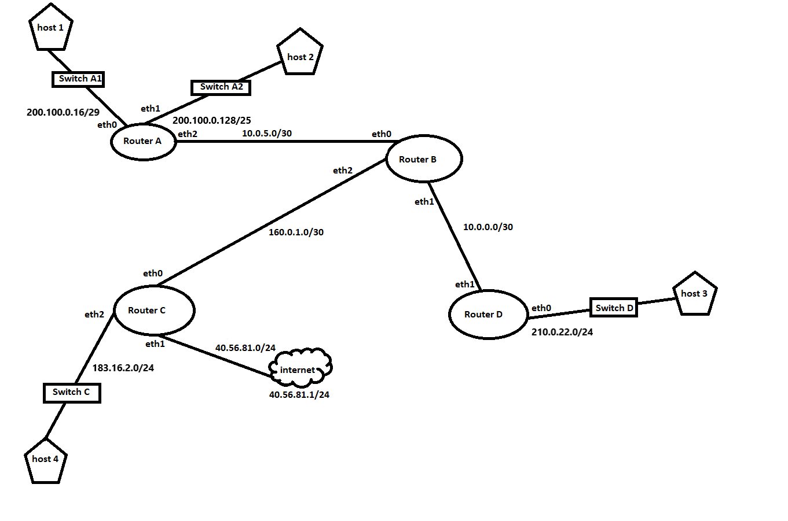
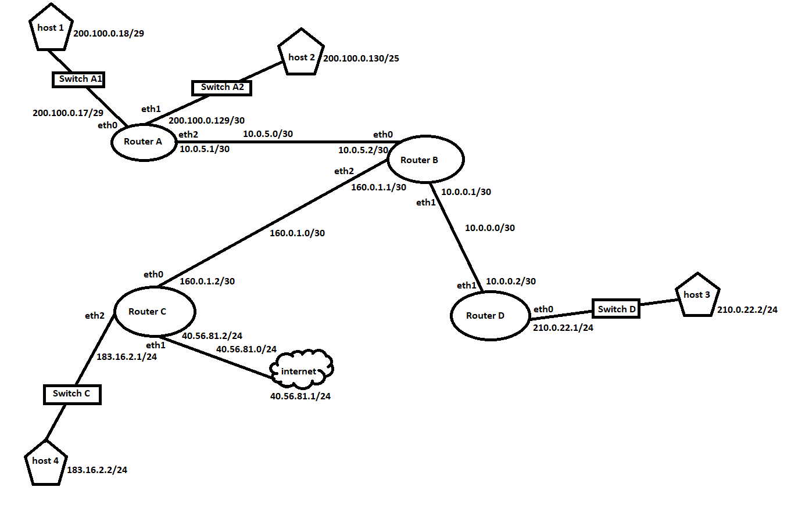

<table align="center" cellspacing=1 cellpadding=1>
    <tr>
        <td>
            <table align="center" cellspacing=1 cellpadding=1>
                <tr>
                    <th align="center" colspan="4">Router A</th>
                </tr>
                <tr>
                    <th align="center">Destination</th>
                    <th align="center">Gateway</th>
                    <th align="center">Genmask</th>
                    <th align="center">Iface</th>
                </tr>
                <tr>
                    <td align="center">200.100.0.128</td>
                    <td align="center">0.0.0.0</td>
                    <td align="center">255.255.255.128</td>
                    <td align="center">eth1</td>
                </tr>
                <tr>
                    <td align="center">200.100.0.16</td>
                    <td align="center">0.0.0.0</td>
                    <td align="center">255.255.255.248</td>
                    <td align="center">eth0</td>
                </tr>
                <tr>
                    <td align="center">10.0.5.0</td>
                    <td align="center">0.0.0.0</td>
                    <td align="center">255.255.255.252</td>
                    <td align="center">eth2</td>
                </tr>
            </table>
        </td>
        <td>
            <table align="center" cellspacing=1 cellpadding=1>
                <tr>
                    <th align="center" colspan="4">Router B</th>
                </tr>
                <tr>
                    <th align="center">Destination</th>
                    <th align="center">Gateway</th>
                    <th align="center">Genmask</th>
                    <th align="center">Iface</th>
                </tr>
                <tr>
                    <td align="center">160.0.1.0</td>
                    <td align="center">0.0.0.0</td>
                    <td align="center">255.255.255.252</td>
                    <td align="center">eth2</td>
                </tr>
                <tr>
                    <td align="center">10.0.0.0</td>
                    <td align="center">0.0.0.0</td>
                    <td align="center">255.255.255.252</td>
                    <td align="center">eth1</td>
                </tr>
                <tr>
                    <td align="center">10.0.5.0</td>
                    <td align="center">0.0.0.0</td>
                    <td align="center">255.255.255.252</td>
                    <td align="center">eth0</td>
                </tr>
            </table>
        </td>
    </tr>
</table> 

<table align="center" cellspacing=1 cellpadding=1>
    <tr>
        <td>
            <table align="center" cellspacing=1 cellpadding=1>
                <tr>
                    <th align="center" colspan="4">Router C</th>
                </tr>
                <tr>
                    <th align="center">Destination</th>
                    <th align="center">Gateway</th>
                    <th align="center">Genmask</th>
                    <th align="center">Iface</th>
                </tr>
                <tr>
                    <td align="center">160.0.1.0</td>
                    <td align="center">0.0.0.0</td>
                    <td align="center">255.255.255.252</td>
                    <td align="center">eth0</td>
                </tr>
                <tr>
                    <td align="center">183.10.2.0</td>
                    <td align="center">0.0.0.0</td>
                    <td align="center">255.255.255.0</td>
                    <td align="center">eth2</td>
                </tr>
                <tr>
                    <td align="center">40.56.81.0</td>
                    <td align="center">0.0.0.0</td>
                    <td align="center">255.255.255.0</td>
                    <td align="center">eth1</td>
                </tr>
                <tr>
                    <td align="center">0.0.0.0</td>
                    <td align="center">40.56.81.1</td>
                    <td align="center">0.0.0.0</td>
                    <td align="center">eth1</td>
                </tr>
            </table>
        </td>
        <td>
            <table cellspacing=1 cellpadding=1>
                <tr>
                    <th align="center" colspan="4">Router D</th>
                </tr>
                <tr>
                    <th align="center">Destination</th>
                    <th align="center">Gateway</th>
                    <th align="center">Genmask</th>
                    <th align="center">Iface</th>
                </tr>
                <tr>
                    <td align="center">10.0.0.0</td>
                    <td align="center">0.0.0.0</td>
                    <td align="center">255.255.255.252</td>
                    <td align="center">eth1</td>
                </tr>
                <tr>
                    <td align="center">210.0.22.0</td>
                    <td align="center">0.0.0.0</td>
                    <td align="center">255.255.255.0</td>
                    <td align="center">eth0</td>
                </tr>
            </table>
        </td>
    </tr>
</table>

1. Suponiendo que las siguientes tablas de rutas proveen Información de redes directamente conectadas y de la salida a Internet de la Organización a través del "router C", se requiere que:
    1. Arme la topologia en base a la informacion de las tablas de rutas.

        

    2. Elija direcciones IP para los distintos routers de la topología, acorde a las redes que los mismos conectan y anote las mismas sobre la topologia.

        

    3. Configure las rutas que considere necesarias en cada una de las tablas de rutas, para que los *host* en cada una de las redes de la topología puedan comunicarse con los *hosts* que están en otras redes y también conectarse a Internet.

    <table align="center" cellspacing=1 cellpadding=1>
        <tr>
            <td>
                <table align="center" cellspacing=1 cellpadding=1>
                    <tr>
                        <th align="center" colspan="4">Router A</th>
                    </tr>
                    <tr>
                        <th align="center">Destination</th>
                        <th align="center">Gateway</th>
                        <th align="center">Genmask</th>
                        <th align="center">Iface</th>
                    </tr>
                    <tr>
                        <td align="center">200.100.0.128</td>
                        <td align="center">0.0.0.0</td>
                        <td align="center">255.255.255.128</td>
                        <td align="center">eth1</td>
                    </tr>
                    <tr>
                        <td align="center">200.100.0.16</td>
                        <td align="center">0.0.0.0</td>
                        <td align="center">255.255.255.248</td>
                        <td align="center">eth0</td>
                    </tr>
                    <tr>
                        <td align="center">10.0.5.0</td>
                        <td align="center">0.0.0.0</td>
                        <td align="center">255.255.255.252</td>
                        <td align="center">eth2</td>
                    </tr>
                    <tr>
                        <td align="center">160.0.1.0</td>
                        <td align="center">10.0.5.2</td>
                        <td align="center">255.255.255.252</td>
                        <td align="center">eth2</td>
                    </tr>
                    <tr>
                        <td align="center">10.0.0.0</td>
                        <td align="center">10.0.5.2</td>
                        <td align="center">255.255.255.252</td>
                        <td align="center">eth2</td>
                    </tr>
                    <tr>
                        <td align="center">210.0.22.0</td>
                        <td align="center">10.0.5.2</td>
                        <td align="center">255.255.255.252</td>
                        <td align="center">eth2</td>
                    </tr>
                    <tr>
                        <td align="center">183.16.2.0</td>
                        <td align="center">10.0.5.2</td>
                        <td align="center">255.255.255.252</td>
                        <td align="center">eth2</td>
                    </tr>
                    <tr>
                        <td align="center">40.56.81.0</td>
                        <td align="center">10.0.5.2</td>
                        <td align="center">255.255.255.252</td>
                        <td align="center">eth2</td>
                    </tr>
                    <tr>
                        <td align="center">0.0.0.0</td>
                        <td align="center">10.0.5.2</td>
                        <td align="center">0.0.0.0</td>
                        <td align="center">eth2</td>
                    </tr>
                </table>
            </td>
            <td>
                <table align="center" cellspacing=1 cellpadding=1>
                    <tr>
                        <th align="center" colspan="4">Router B</th>
                    </tr>
                    <tr>
                        <th align="center">Destination</th>
                        <th align="center">Gateway</th>
                        <th align="center">Genmask</th>
                        <th align="center">Iface</th>
                    </tr>
                    <tr>
                        <td align="center">160.0.1.0</td>
                        <td align="center">0.0.0.0</td>
                        <td align="center">255.255.255.252</td>
                        <td align="center">eth2</td>
                    </tr>
                    <tr>
                        <td align="center">40.56.81.0</td>
                        <td align="center">160.0.1.2</td>
                        <td align="center">255.255.255.252</td>
                        <td align="center">eth2</td>
                    </tr>
                    <tr>
                        <td align="center">183.16.2.0</td>
                        <td align="center">160.0.1.2</td>
                        <td align="center">255.255.255.252</td>
                        <td align="center">eth2</td>
                    </tr>
                    <tr>
                        <td align="center">10.0.0.0</td>
                        <td align="center">0.0.0.0</td>
                        <td align="center">255.255.255.252</td>
                        <td align="center">eth1</td>
                    </tr>
                    <tr>
                        <td align="center">210.0.22.0</td>
                        <td align="center">10.0.0.2</td>
                        <td align="center">255.255.255.252</td>
                        <td align="center">eth1</td>
                    </tr>
                    <tr>
                        <td align="center">10.0.5.0</td>
                        <td align="center">0.0.0.0</td>
                        <td align="center">255.255.255.252</td>
                        <td align="center">eth0</td>
                    </tr>
                    <tr>
                        <td align="center">200.100.0.128</td>
                        <td align="center">10.0.5.1</td>
                        <td align="center">255.255.255.252</td>
                        <td align="center">eth0</td>
                    </tr>
                    <tr>
                        <td align="center">200.100.0.16</td>
                        <td align="center">10.0.5.1</td>
                        <td align="center">255.255.255.252</td>
                        <td align="center">eth0</td>
                    </tr>
                    <tr>
                        <td align="center">0.0.0.0</td>
                        <td align="center">160.0.1.2</td>
                        <td align="center">0.0.0.0</td>
                        <td align="center">eth2</td>
                    </tr>
                </table>
            </td>
        </tr>
    </table> 

    <table align="center" cellspacing=1 cellpadding=1>
        <tr>
            <td>
                <table align="center" cellspacing=1 cellpadding=1>
                    <tr>
                        <th align="center" colspan="4">Router C</th>
                    </tr>
                    <tr>
                        <th align="center">Destination</th>
                        <th align="center">Gateway</th>
                        <th align="center">Genmask</th>
                        <th align="center">Iface</th>
                    </tr>
                    <tr>
                        <td align="center">160.0.1.0</td>
                        <td align="center">0.0.0.0</td>
                        <td align="center">255.255.255.252</td>
                        <td align="center">eth0</td>
                    </tr>
                    <tr>
                        <td align="center">10.0.0.0</td>
                        <td align="center">160.0.1.1</td>
                        <td align="center">255.255.255.252</td>
                        <td align="center">eth0</td>
                    </tr>
                    <tr>
                        <td align="center">210.0.22.0</td>
                        <td align="center">160.0.1.1</td>
                        <td align="center">255.255.255.252</td>
                        <td align="center">eth0</td>
                    </tr>
                    <tr>
                        <td align="center">10.0.5.0</td>
                        <td align="center">160.0.1.1</td>
                        <td align="center">255.255.255.252</td>
                        <td align="center">eth0</td>
                    </tr>
                    <tr>
                        <td align="center">200.100.0.16</td>
                        <td align="center">160.0.1.1</td>
                        <td align="center">255.255.255.252</td>
                        <td align="center">eth0</td>
                    </tr>
                    <tr>
                        <td align="center">200.100.0.128</td>
                        <td align="center">160.0.1.1</td>
                        <td align="center">255.255.255.252</td>
                        <td align="center">eth0</td>
                    </tr>
                    <tr>
                        <td align="center">183.10.2.0</td>
                        <td align="center">0.0.0.0</td>
                        <td align="center">255.255.255.0</td>
                        <td align="center">eth2</td>
                    </tr>
                    <tr>
                        <td align="center">40.56.81.0</td>
                        <td align="center">0.0.0.0</td>
                        <td align="center">255.255.255.0</td>
                        <td align="center">eth1</td>
                    </tr>
                    <tr>
                        <td align="center">0.0.0.0</td>
                        <td align="center">40.56.81.1</td>
                        <td align="center">0.0.0.0</td>
                        <td align="center">eth1</td>
                    </tr>
                </table>
            </td>
            <td>
                <table cellspacing=1 cellpadding=1>
                    <tr>
                        <th align="center" colspan="4">Router D</th>
                    </tr>
                    <tr>
                        <th align="center">Destination</th>
                        <th align="center">Gateway</th>
                        <th align="center">Genmask</th>
                        <th align="center">Iface</th>
                    </tr>
                    <tr>
                        <td align="center">10.0.0.0</td>
                        <td align="center">0.0.0.0</td>
                        <td align="center">255.255.255.252</td>
                        <td align="center">eth1</td>
                    </tr>
                    <tr>
                        <td align="center">10.0.5.0</td>
                        <td align="center">10.0.0.1</td>
                        <td align="center">255.255.255.252</td>
                        <td align="center">eth1</td>
                    </tr>
                    <tr>
                        <td align="center">200.100.0.128</td>
                        <td align="center">10.0.0.1</td>
                        <td align="center">255.255.255.252</td>
                        <td align="center">eth1</td>
                    </tr>
                    <tr>
                        <td align="center">200.100.0.16</td>
                        <td align="center">10.0.0.1</td>
                        <td align="center">255.255.255.252</td>
                        <td align="center">eth1</td>
                    </tr>
                    <tr>
                        <td align="center">160.0.1.0</td>
                        <td align="center">10.0.0.1</td>
                        <td align="center">255.255.255.252</td>
                        <td align="center">eth1</td>
                    </tr>
                    <tr>
                        <td align="center">183.16.2.0</td>
                        <td align="center">10.0.0.1</td>
                        <td align="center">255.255.255.252</td>
                        <td align="center">eth1</td>
                    </tr>
                    <tr>
                        <td align="center">40.56.81.0</td>
                        <td align="center">0.0.0.0</td>
                        <td align="center">255.255.255.252</td>
                        <td align="center">eth1</td>
                    </tr>
                    <tr>
                        <td align="center">210.0.22.0</td>
                        <td align="center">0.0.0.0</td>
                        <td align="center">255.255.255.0</td>
                        <td align="center">eth0</td>
                    </tr>
                    <tr>
                        <td align="center">0.0.0.0</td>
                        <td align="center">10.0.0.1</td>
                        <td align="center">0.0.0.0</td>
                        <td align="center">eth1</td>
                    </tr>
                </table>
            </td>
        </tr>
    </table>

2. fdbthtrhrh