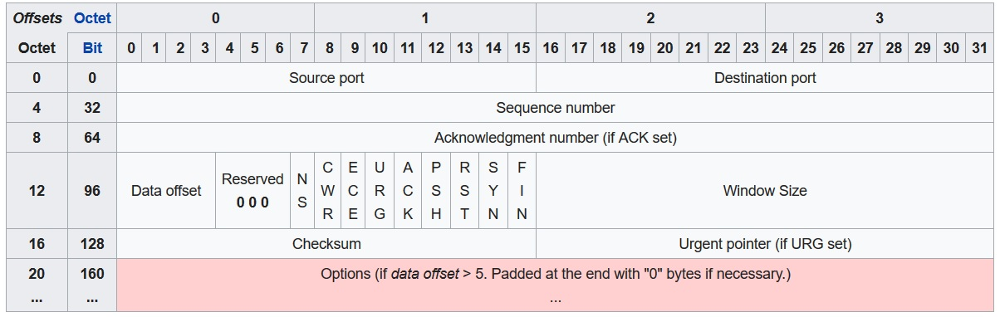
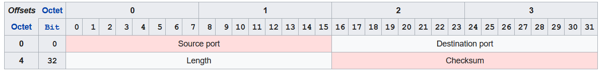
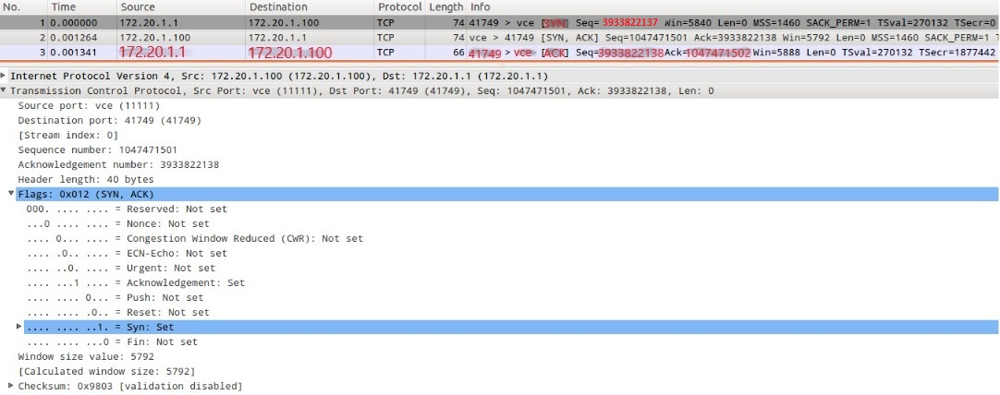
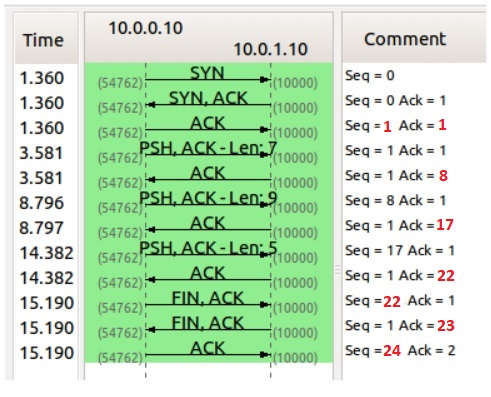
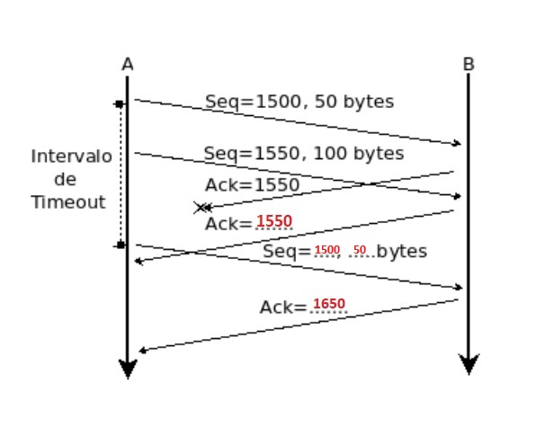

# Capa de Transporte - Parte I

1. ¿Cuál es la función de la capa de transporte?

    La capa de transporte es responsable de preparar los datos de la aplicación para el transporte a través de la red y procesar los datos de la red para su utilización por parte de las aplicaciones. Es principalmente responsable de:
    * Seguimiento de la comunicación individual entre aplicaciones en los hosts origen y destino.
    * Segmentación de datos y gestión de cada porción.
    * Reensamble de segmentos en flujos de datos de aplicación.
    * Identificación de las diferentes aplicaciones.

2. Describa la estructura del segmento TCP y UDP.

    

    * Source port(_puerto fuente_): 16 bits. Identifica al puerto que envía.
    * Destination port(_puerto destino_): 16 bits. Identifica al puerto que recibe.
    * Sequence number(_Número de secuencia_): 32 bits. Tiene un rol doble:
        + Si el flag SYN está seteado(en 1), entonces es el número de secuencia inicial. El número de secuencia del primer byte de datos será el ISN+1 ya que el flag SYN consume un número de secuencia. 
        + Si el flag SYN está limpio(en 0), entonces es el número de secuencia acumulado del primer byte de data en tal segmento durante la sesión actual.
    * Acknowledgment number(_Número de confirmación_): 32 bits. Si el flag ACK está seteado entonces el valor de este campo es el siguiente número de secuencia que el emisor del ACK espera. Esto acusa la recepción todos los bytes anteriores(si hubiera alguno). El primer ACK enviado por cada extremo acusa el número de secuencia inicial del otro extremo, pero sin data.  
    No se pueden acusar partes selectivas del flujo de datos(suponiendo que no estamos usando la opción SACK de acuse selectivo). Por ejemplo, si se reciben correctamente los bytes 1-1024 y el siguiente segmento contiene los bytes 2049-3072, el receptor no puede acusar la recepción de este último segmento. Lo único que puede hacer es enviar un ACK con 1025 como número de acuse. Procederá del mismo modo si le llegare el segmento 1025-2048 pero con error de checksum.
    * Data offset(_Longitud de cabecera_): 4 bits. Especifica el tamaño de la cabecera de TCP en palabras de 32 bits. El tamaño mínimo de la cabecera es de 5 palabras y la máxima es de 15, lo que da un tamaño mínimo de 20 bytes y un máximo de 60, permitiendo hasta 40 bytes de opciones en la cabecera.
    * Reserved(_Reservado_): 3 bits. Para uso futuro, debe estar en 0.
    * Flags(_AKA bits de control_): 9 bits.
        + NS(1 bit): ECN-nonce concealment protection. Sirve para proteger frente a paquetes accidentales o maliciosos que se aprovechan del control de congestión para ganar ancho de banda de la red.
        + CWR(1 bit): Congestion Window Reduced. El flag se activa por el host emisor para indicar que ha recibido un segmento TCP con el flag ECE activado y ha respondido con el mecanismo de control de congestión.
        + ECE(1 bit): ECN-Echo tiene un rol doble, dependiendo del valor del flag SYN:
            - Si el flag SYN está seteado, el par TCP tiene capacidad ECN.
            - Si el flag SYN está limpio, se recibió un paquete con el flag de congestión con experiencia seteado(ECN=11) en el encabezado IP durante la transmisión normal. Esto sirve de indicador de congestión de red(o congestión inminente) al emisor de TCP.
        + URG(1 bit): indica que el campo del puntero urgente es válido.
        + ACK(1 bit): indica que el campo de acuse es válido. Todos los paquetes enviados por el cliente después del paquete SYN inicial deben tener activo este flag.
        + PSH(1 bit): Push. Pide un _push_ de los datos almacenados a la aplicación receptora.
        + RST(1 bit): Reset. Reinicia la conexión cuando falla el intento de conexión o al rechazar paquetes no válidos.
        + SYN(1 bit): Synchronize. Sincroniza los números de secuencia para iniciar la conexión. Solo el primer paquete enviado de cada extremo debería tener este flag seteado.
        + FIN(1 bit): el último paquete del emisor. Se utiliza para solicitar la liberación de la conexión.
    * Window size(Tamaño de ventana): 16 bits. El tamaño de la ventana del receptor, la cual especifica, en número de unidades de tamaño de ventana(por defecto, bytes) que pueden ser metidos en el buffer de recepción o, dicho de otro modo, el número máximo de unidades pendientes de acuse. Es un sistema de control de flujo.
    * Checksum(Suma de verificación): 16 bits. Checksum utilizado para la comprobación de errores tanto en la cabecera como en los datos.
    * Urgent pointer(Puntero urgente): 16 bits. Si el flag está seteado, indica la cantidad de bytes desde el número de secuencia que indica el lugar donde acaban los datos urgentes.
    * Options(Opciones): se usa para añadir características no cubiertas por la cabecera fija, como el SACK, la escala de la ventana y el tamaño máximo del segmento, entre otras.
    * Padding(Relleno): se utiliza para asegurarse que la cabecera acaba con un tamaño múltiplo de 32 bits. El padding se compone de zeros.

    

    * Source port number(Número de puerto fuente): Este campo, cuando es usado, identifica al puerto del emisor y debería asumirse como el puerto a responder, si fuera necesario. Si no es usado, debería ser zero. Si el host fuente es el cliente, el número del puerto sea probablemente un número de puerto efímero. Si el host fuente es el servidor, el número de puerto sea probablemente uno ya bien conocido.
    * Destination port number(Número de puerto destino): Este campo identifica al puerto del receptor y es requerido. Muy similar a lo que ocurre con el puerto fuente, si el cliente es el host de destino, el número del puerto sea probablemente un número de puerto efímero; y si el host destino es el servidor, el número de puerto sea probablemente uno ya bien conocido.
    * Length(Longitud): Este campo especifica la longitud en bytes del header UDP y la data UDP. La mínima es 8 bytes, la longitud del header. El tamaño teórico del campo es de 65535 bytes(8 bytes de header y 65257 bytes de data) para un datagrama UDP. Sin embargo, el límite actual, el cual es impuesto por el protocolo IPv4 subyaciente es de 65507 bytes(Si son 65535, 8 bytes son de header, y 20 bytes son de header IPv4). Usando jumbograms de IPv6 es posible que los paquetes de UDP sean más grandes que 65535 bytes.
    * Checksum(Suma de verificación): El campo del checksum podría ser utilizado para la comprobación de errores en el header y la data. Este campo es opcional en IPv4 y obligatorio en IPv6. Si no es usado, se llena con zeros.

3. ¿Cuál es el objetivo del uso de puertos en el modelo TCP/IP?

    //PREGUNTAR. El objetivo de los puertos es que en cada uno se aloje un proceso de aplicación. Si no hubieran tantos puertos, no se podrían llevar a cabo tantas conexiones TCP. Cada puerto tiene asignado un socket que es la "puerta" entre la capa de aplicación y transporte.

4. Compare TCP y UDP en cuanto a:

| Característica| TCP | UDP |
| :---: | :---: | :---: |
| Confiabilidad | TCP ofrece una garantía absoluta de que los segmentos transferidos llegará intactos y en mismo orden en que fueron enviados. | No hay garantía de que los datagramas lleguen. |
| Multiplexación | Habremos de tener en cuenta la dirección IP de origen y de destino, así como también el puerto de origen y de destino. | Los campos que requeriremos serán los puertos de orgen y destino. |
| Orientado a la conexión | Orientado | No orientado |
| Utilización de puertos | Utiliza el concepto de número de puerto para identificar a las aplicaciones emisoras y receptoras. Cada lado de la conexión TCP tiene asociado un número de puerto(de 16 bits sin signo, por lo que existen 65536 puertos posibles) asignado por la aplicación emisora o receptora. Los puertos se clasifican en tres grupos: los bien conocidos, los registrados y los dinámicos. Los puertos bien conocidos son asignados por la IANA, van del 0 al 1023 y son usados normalmente por el sistema o por procesos con privilegios. Las aplicaciones que usan este tipo de puertos son ejecutadas como servidores y se quedan a la escucha de conexiones. Algunos ejemplos son FTP(21), SSH(22) o TELNET(23). Los puertos registrados son normalmente empleados por las aplicaciones de usuario de forma temporal cuando conectan con los servidores, pero también pueden representar servicios que hayan sido registrados por un tercero. Su rango va de 1024 a 49151. Los puertos dinámicos  también pueden ser usados por las aplicaciones de usuario, pero este caso es menos común. Los puertos dinámicos no tienen significado fuera de la conexióon TCP en la que fueron usados. Su rango va de 49152 a 65535.| El campo de puerto tiene una longitud de 16 bits, por lo que el rango de valores válidos va desde 0 a 65535. El puerto 0 está reservado, pero es un valor permitido como puerto origen si el proceso emisor no espera recibir mensajes como respuesta. Los puertos 1 a 1023 son llamados bien conocidos y en sistemas operativos tipo unix enlazar con uno de ellos requiere acceso como superusuario. Los puertos 1024 a 49151 son los puertos registrados.  Los puertos 49152 a 65535 son llamados puertos efímeros y son utilizados como puertos temporales, sobre todo por los clientes al comunicarse con los servidores.|
| Número de protocolo según IP | 6 | 17 |

5. La PDU de la capa de transporte es el segmento. Sin embargo, en algunos contextos suele utilizarse el término datagrama. Indique cuándo.

    //PREGUNTAR. Se suele hablar de segmento TCP y datagrama UDP, dado el propio nombre de UDP(Used Datagram Protocol).

6. Describa el saludo de tres vías de TCP.

    Par establecer una conexión, TCP utiliza el llamado _three-way handshake_. Antes de que un cliente intente conectarse con un servidor, el servidor debe enlazarse y escuchar por un puerto para abrirlo a futuras conexiones: esto es lo que se denomina apertura pasiva. Una vez establecida la apertura pasiva, un cliente puede iniciar una apertura activa. Para establecer la conexión, the three-way(or three-step) handshake se produce de la siguiente forma:
    1. SYN: La apertura activa es realizada por el cliente enviando un SYN al servidor. El cliente establece el número de secuencia del segmento a un valor aleatorio, supongamos A.
    2. SYN-ACK: en respuesta, el servidor responde con SYN-ACK. El número de confirmación es establecido en uno más que el número de secuencia recibido, en este caso, A+1, y el número de secuencia que el servidor elige para el segmento es otro número aleatorio, llamémoslo B.
    3. ACK: finalmente, el cliente envía un ACK al servidor. El número de secuencia es establecido según el valor de confirmación, en este caso, A+1, y el valor de confirmación es establecido a uno más que el número de secuencia recibido, en nuestro caso, B+1.

    En este punto, tanto el cliente como el servidor han recibido una confirmación de la conexión. Los pasos 1 y 2 establecen el parámetro de conexión(número de secuencia) para uno de los extremos y es confirmado. Los pasos 2 y 3 establecen el parámetro de conexión(número de secuencia) para el otro extremo y es confirmado. Con esto, una comunicación bidireccional completa(full-duplex) es establecida.

7. Investigue qué es el ISN(Initial Sequence Number). Relaciónelo con el saludo de tres vías.

    Es un número de secuencia de 32-bit único asignado a cada nueva conexión en TCP. Ayuda con la asignación de un número de secuencia que no entre en conflicto con otros bytes de datos transmitidos a través de una conexión TCP. Un ISN es único para cada conexión y separado por cada dispositivo.

8. //PASO DE LARGO

9. ¿Qué sucede si llega un segmento TCP a un host que no tiene ningún proceso esperando en el puertodestino de dicho segmento (es decir, que dicho puerto no está en estado LISTEN)
    a. Utilice hping3 para enviar paquetes TCP al puerto destino 22 de la máquina virtual con el flag SYN activado.
    b. Utilice hping3 para enviar paquetes TCP al puerto destino 40 de la máquina virtual con el flag SYN activado.
    c. ¿Qué diferencias nota en las respuestas obtenidas en los dos casos anteriores? ¿Puede explicar aqué se debe? (Ayuda: utilice el comando ss visto anteriormente)

10. ¿Qué sucede si llega un datagrama UDP a un host que no tiene a ningún proceso esperando en el puerto destino de dicho datagrama(es decir, que dicho puerto no está en estado LISTEN)?
    a. Utilice hping3 para enviar datagramas UDP al puerto destino 68 de la máquina virtual.
    b. Utilice hping3 para enviar datagramas UDP al puerto destino 40 de la máquina virtual.
    c. ¿Qué diferencias nota en las respuestas obtenidas en los dos casos anteriores? ¿Puede explicar aqué se debe? (Ayuda: utilice el comando ss visto anteriormente).

11. Investigue qué es multicast ¿Sobre cuál de los protocolos de capa de transporte funciona? ¿Se podría adaptar para que funcione sobre el otro protocolo de capa de transporte? ¿Por qué?

    Es un método de envío simultáneo de paquetes(a nivel de IP) que tan solo serán recibidos por un determinado grupo de receptores, que están interesados en los mismos. Multicast usa UDP porque es más chico, simple y eficiente que TCP. El único problema es si uno de los receptores no recibe uno o más mensajes: no hya forma de que yo sepa que no le llegó así como también el no tiene forma de saber que yo le envié algo. Por lo general, el multicast está preparado para estas situaciones con una serie de mecanismos(_brokers_) que ayudan a que los mensajes no se pierdan. Si bien podría realizarse multicast usando TCP, sería exponencialmente costoso por toda la confiabilidad que, a cambio, el protocolo brinda.

12. QUEDA PENDIENTE

13. De acuerdo a la captura de la siguiente figura, indique los valores de los campos borroneados.

    

14. Dada la sesión TCP de la figura, completar los valores marcados con un signo de interrogación.

    

15. Completar los datos que faltan en el intercambio de mensajes del siguiente diagrama de flujo TCP:

    