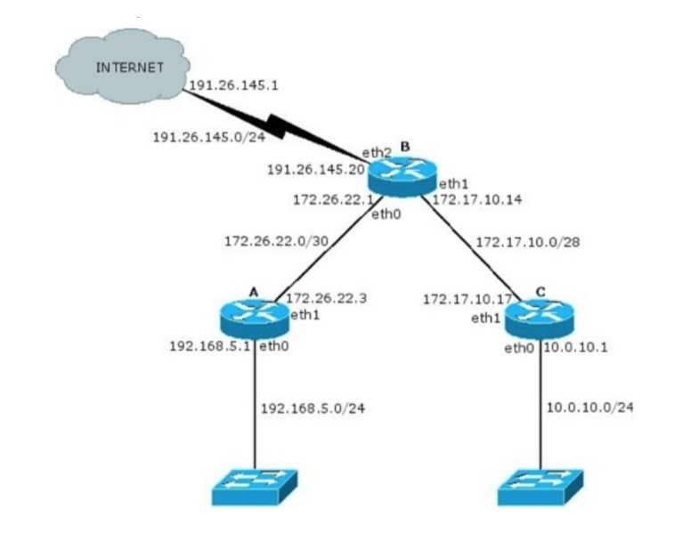

# Capa de Red - Direccionamiento

1. ¿Qué servicios presta la capa de red? ¿Cuál es la PDU en esta capa? ¿Qué dispositivo es considerado sólo de la capa de red?

    Proporciona conectividad y selección de ruta entre dos sistemas de hosts que pueden estar ubicados en redes geográficamente distintas

    La capa de red provee los medios de transferencia de paquetes de red de longitud variable desde un host fuente a otro destino via una o más redes. Responde a las solicitudes de servicio de la capa de transporte y emite solicitudes de servicio a la capa de enlace de datos.

    Entre otras funcionalidades incluye:

    * Comunicación sin conexión: el protocolo IP, por ejemplo, es sin conexión, esto es, que el paquete de datos puede viajar desde un remitente a un receptor, sin que el receptor tenga que enviar un ACK necesariamente. Si bien existen protocolos orientados a conexión, estos son de capas superiores del modelo OSI.
    * Direccionamiento de host: cada host debe tener una única dirección que determine dónde se encuentra. Esta dirección, es normalmente asignada por un sistema jerárquico.
    * Reenvío de mensajes: dado que muchas redes están particionadas en subredes y conectan con otras redes para comunicaciones grandes, es que tales redes utilizan hosts especializados, llamados gateways o routers, para reenviar paquetes entre redes.

    En esta capa, la PDU es el paquete. Solo los routers o gateways pertenecen a esta capa.

2. ¿Cuántas redes clase A, B y C hay? ¿Cuántos hosts, como máximo, pueden tener cada una?

    Clase | Cantidad de redes | Cantidad de hosts
    :---------:|:----------:|:---------:
    A | 128, sin contar las de loopback ya que no son utilizables | 16.777.214
    B | 16384 | 65.534
    C | 2.097.152 | 254

3. ¿Qué son las subredes? ¿Por qué es importante siempre especificar la máscara de subred asociada?

    Una subnet es una división lógica de una red IP. La división de una red en dos o más redes se denomina subnetting.

4. Describa qué es y para qué sirve el protocolo ICMP.

    Es un protocolo que permite administrar información relacionada con errores de los equipos en red. Si se tienen en cuenta los escasos controles que lleva a cabo el protocolo IP, ICMP no permite corregir los errores sino que los notifica a los protocolos de capas cercanas. Por lo tanto, el protocolo ICMP es usado por todos los router para indicar errores.

    1. Analice cómo funciona el comando ping.

        Lo que hace PING es mandar un paquete a una dirección designada y esperar una respuesta. Funciona de manera similar al pulso de sonar de un submarino.

        1. Indique el tipo y código ICMP que usa el ping.

            El _echo request_ tiene el tipo 8 y código 0.

        2. Indique el tipo y código ICMP que usa la respuesta de un ping.

            El _echo reply_ utiliza el tipo 0 y código 0.

    2. Analice cómo funciona el comando traceroute(tracert en Windows) y cómo manipula el campo TTL de los paquetes IP.

        El TTL es un campo que sirve para que un paquete no permanezca en la red de forma indefinida. Es un número entero que es decrementado por cada nodo por el que pasa el paquete. De tal forma, cuando el campo TTL llega al valor 0 ya no se reenviará más, sino que el nodo que lo esté manejando en ese momento lo descartará. Lo que hace tracert es mandar paquetes a la red de forma que el primer paquete lleve un valor TTL=1, el segundo TTL=2, etc. De esta forma, el primer paquete será eliminado por el primer nodo al que llegue(ya que este nodo decrementará el valor TTl, llegando a 0). Cuando un nodo elimina un paquete, envía al emisor un mensaje de control especial indicando una incidencia. Tracert usa esta respuesta para averiguar la dirección IP del nodo que desechó el paquete, que será el primer nodo de la red. La segunda vez que se manda un paquete, el TTL vale 2, por lo que pasará el primer nodo y llegará al segundo, donde será descartado, devolviendo de nuevo un mensaje de control. Esto se hace de forma sucesiva hasta que el paquete llega a su destino.

    3. Indique la cantidad de saltos realizados desde su computadora hasta el sitio info.unlp.edu.ar. En algunos de los saltos ¿Muestra el nombre del dominio asociado al salto y su ip? Detalle los encontrados.

        //preugntar

    4. Verifique el recorrido a dos de los servidores de mail de gmail.com y compare los saltos realizados ¿Realizaron la misma cantidad de saltos, hicieron el mismo camino?

        //preguntar

5. ¿Para que se usa el bloque 127.0.0.0/8? ¿Qué PC responde a los siguientes comandos?

    1. ping 127.0.0.1
    2. ping 127.0.54.43
    
    Son las llamadas direcciones de loopback utilizadas para probar la capacidad de la tarjeta interna si se están enviando datos BGP. También se usan cuando una transmisión de datos tiene como destino el propio host o durante tareas de diagnóstico de conectividad y validez del protocolo de comunicación.

6. Investigue para qué sirven los comandos _ifconfig_ y _route_ ¿Qué comandos podría utilizar en su reemplazo? Inicie una topología con CORE, cree una máquina y utilice en ella los comandos anteriores para practicar sus diferentes opciones, mínimamente:

* Configurar y quitar una dirección IP en una interfaz.
* Ver la tabla de ruteo de la máquina.

_ifconfig_ permite configurar o desplegar numerosos parámetros de las interfaces de red residentes en el núcleo, como la dirección IP(ya sea estática o dinámica), o la máscara de red. Si se lo llama sin argumentos suele mostrar la configuración vigente de las interfaces de red activas, con detalles como la dirección MAC o el tráfico que ha circulado por las mismas hasta el momento.  
_route_ es una herramienta que permite manipular las tablas de enrutamiento del sistema.

### División en subredes

7. Para cada una de las siguientes direcciones IP (172.16.58.223/26, 163.10.5.49/27, 128.10.1.0/23, 10.1.0.0/24, 8.40.11.179/12) determine:

    1. ¿De qué clase de red es la dirección dada (Clase A, B o C)?

        172.16.58.223/26: Clase B.  
        163.10.5.49/27: Clase B.  
        128.10.1.0/23: Clase B.  
        10.1.0.0/24: Clase A.  
        8.40.11.179/12: Clase A.

    2. ¿Cuál es la dirección de subred?

        172.16.58.223/26: 172.16.58.192/26.  
        163.10.5.49/27: 163.10.5.32/27.  
        128.10.1.0/23: 128.10.0.0/23.  
        10.1.0.0/24: 10.1.0.0/24.  
        8.40.11.179/12: 8.32.0.0/12.

    3. ¿Cuál es la cantidad máxima de hosts que pueden estar en esa subred?

        172.16.58.223/26: quedan para usar 6 bits, por lo que 2^6 - 2(por la dirección de subred y la de broadcast que no son utilizables), es decir, 62 hosts.  
        163.10.5.49/27: quedan para usar 5 bits, por lo que 2^5 - 2(por la dirección de subred y la de broadcast que no son utilizables), es decir, 30 hosts.  
        128.10.1.0/23: quedan para usar 9 bits, por lo que 2^9 - 2(por la dirección de subred y la de broadcast que no son utilizables), es decir, 510 hosts.  
        10.1.0.0/24: quedan para usar 8 bits, por lo que 2^8 - 2(por la dirección de subred y la de broadcast que no son utilizables), es decir, 254 hosts.  
        8.40.11.179/12: quedan para usar 20 bits, por lo que 2^20 - 2(por la dirección de subred y la de broadcast que no son utilizables), es decir, 1048574 hosts.

    4. ¿Cuál es la dirección de broadcast de esa subred?

        172.16.58.223/26: 172.16.58.255/26.  
        163.10.5.49/27: 163.10.5.63/27.  
        128.10.1.0/23: 128.10.1.255/23.  
        10.1.0.0/24: 10.1.0.255/24.  
        8.40.11.179/12: 8.47.255.255/12.

    5. ¿Cuál es el rango de direcciones IP válidas dentro de la subred?

        172.16.58.223/26: 172.16.58.193/26 - 172.16.58.254/26.  
        163.10.5.49/27: 163.10.5.33/27 - 163.10.5.62/27.  
        128.10.1.0/23: 128.10.0.1/23 - 128.10.1.254/23.  
        10.1.0.0/24: 10.1.0.1/24 - 10.1.0.254/24.  
        8.40.11.179/12: 8.32.0.1/12 - 8.47.255.254/12.

8. Su organización cuenta con la dirección de red 128.50.10.0. Indique:

    1. ¿Es una dirección de red o de host?

        Para determinar si es una dirección de red o de host basta con aplicarle la máscara adecuada a la red y determinarlo. En este caso, 128.50.10.0 se escribe como 10000000 00110010 00001010 00000000 en binario. Como es una dirección de clase B, la máscara por defecto(dado que no se provee otra) es de 16 bits(es decir, 255.255.0.0 será la máscara a usar). En este caso:

        10000000 00110010 00001010 00000000 _Esta es la dirección_  
        11111111 11111111 00000000 00000000 _Esta es la máscara_

         Para que una dirección sea de red es necesario que todos sus bits de host(todos los bits a la derecha de los bits de red) sean 0. En este caso, se puede ver que no lo son, dado que los primeros 16 bits son de red y los otros 16 son de host, y tales bits no están en 0. La dirección de red, en este caso, sería . 

    2. Clase a la que pertenece y máscara de clase.

        Como describí antes, es una red de clase B, dado que está en el rango de 128.0.0.0 - 191.255.255.255.

    3. Cantidad de hosts posibles.

        Para la dirección de red antes calculada(128.50.0.0/16) hay 16 bits de hosts posibles, es decir 2^16 = 65,536‬. A tal número debe sacársele dos hosts, el de red y el de broadcast, que no podrán ser utlizados. Esto nos deja con 65,534.

    4. Se necesitan crear 513 subredes. Indique:

        1. Máscara necesaria.

            Si yo quiero crear 513 subredes, tomo 10 bits de host para la subred(1024 subredes). Eso me deja con una máscara de 26 bits(es decir, 255.255.255.192).

        2. Cantidad de redes asignables.

            Dado que usé 10 bits para la parte de surbred, dispongo de 1024 redes para asignar.

        3. Cantidad de hosts por subred.

            De lo anterior se desprende que me quedan 6 bits para hosts, es decir, 64 hosts. De esos 64 hosts solo hay 62 utilizables, dado que hay dos que deben reservarse, uno de red y otro de broadcast.

        4. Dirección de la subred 710.

            Para calcularla, hay una forma muy fácil que consiste en convertir el 709(recordar que empezamos a contar de 0, por lo que la número 710 es en realidad la 709) en binario, esto es, 1011000101. El siguiente caso es dividirlo en octetos para poder ubicarlo en la parte de la subred, es decir, pasamos de _1011000101_ a _10110001 01_. Luego convertimos la dirección que disponemos(128.50.0.0) en binario y ubicamos la subred en los 10 bits que tiene asignado dentro de los bits de host:

            10000000 00110010 00000000 00000000 _Dirección_  
            10000000 00110010 10110001 01000000 _Subred número 710_

            Se concluye que la dirección resultante es 128.50.176.64/26.

        5. Dirección de broadcast de la subred 710.

            La dirección de broadcast de la subred 710 es el último host de tal subred, es decir:

            10000000 00110010 10110001 01000000 _Subred número 710_  
            10000000 00110010 10110001 01111111 _Host Broadcast de la subred No 710_

            Se concluye que la dirección de broadcast de la subred 710 es 128.50.176.127/26.
            
9. Si usted estuviese a cargo de la administración del bloque IP 195.200.45.0/24:

    1. ¿Qué máscara utilizaría si necesita definir al menos 9 subredes?

        Yo tomaría 4 bits de host, de modo que podría definir, al menos, 16 redes.

    2. Indique la dirección de subred de las primeras 9 subredes.

        195.200.45.0  
        195.200.45.16  
        195.200.45.32  
        195.200.45.48  
        195.200.45.64  
        195.200.45.80  
        195.200.45.96  
        195.200.45.112  
        195.200.45.128

    3. Seleccione una e indique dirección de broadcast y rango de direcciones asignables en esa subred.

        195.200.45.0  
        irección de broadcast: 195.200.45.15.  
        Rango: 195.200.45.1 - 195.200.45.14.

10. Dado el siguiente gráfico:
    

    1. Verifique si es correcta la asignación de direcciones IP y, en caso de no serlo, modifique la misma para que lo sea.

        El primer error que noté es el del enlace punto a punto A-B. La dirección de 172.26.22.3 es incorrecta ya que se está utilizando la dirección de broadcast. En este caso, yo corregiría 172.26.22.3 por 172.26.22.2.  
        El otro error que noté está en el enlace punto a punto B-C. En este caso, el problema está en 172.17.10.17: la dirección se va más allá del esquema de direccionamiento. Para corregir esto, se podría asignar otro host dentro del rango establecido, por ejemplo, 172.17.10.13. Un detalle que quiero remarcar también(quizá no tan detalle) es la máscara. Si bien la asignación de IP con la corrección anterior es correcta, se están desperdiciando direcciones que no sería conveniente desperdiciar. Lo que yo haría para corregir esto es usar un /30 en lugar de /28, y asignarle a uno de los extremos la dirección 172.17.10.1 y al otro la dirección 172.17.10.2.  
        Con la dirección 191.26.145.0/24 me pasa lo mismo: es un enlace punto y, si bien el direccionamiento es correcto, corregiría el desperdicio de direcciones. Lo mismo que el párrafo anterior: se le pone una máscara de /30 a 191.26.145.0 y se asigna 191.26.145.1 a uno de los extremos y 191.26.145.2 al extremo que reste.

    2. ¿Cuántos bits se tomaron para hacer subredes en la red 10.0.10.0/24? ¿Cuántas subredes se podrían generar?

        //PREGUNTAR. Se tomaron 6 bits. El resto quedó para host.

    3. Para cada una de las redes utilizadas indique si son públicas o privadas.

        192.168.5.0 - Red privada.  
        10.0.10.0 - Red privada.  
        172.26.22.0 - Red privada.  
        172.17.10.0 - Red privada.  
        191.26.145.0 -Red pública.

11. ¿Qué es CIDR (Class Interdomain routing)? ¿Por qué resulta útil?

    Es una mejora a la forma de interpretar las direcciones IP. Su introducción permitió una mayor flexibilidad al dividir rangos de direcciones IP en redes separadas. De esta manera, permitió, por un lado, un uso más eficiente de las cada vez más escasas redes IPv4 y, por el otro, un mayor uso de la jerarquía de direcciones, disminuyendo la sobrecarga de los enrutadores principales de internet para realizar el enrutamiento.

12. ¿Cómo publicaría un router las siguientes redes si se aplica CIDR?

    1. 198.10.1.0/24 
    2. 198.10.0.0/24
    3. 198.10.3.0/24
    4. 198.10.2.0/24

    Las publicaría resumiéndolas en la red 198.10.0.0/22.

13. Listar las redes involucradas en los siguientes bloques CIDR:

    1. 200.56.168.0/21

        200.56.168.0/24 - 200.56.175.0/24

    2. 195.24.0.0/13

        195.24.0.0/24 - 195.31.0.0/24

    3. 195.24/13

        195.24.0.0/24 - 195.31.0.0/24

14. El bloque CIDR 128.0.0.0/2 o 128/2 ¿Equivale a listar todas las direcciones de red de clase B? ¿Cuál sería el bloque CIDR que agrupa todas las redes de clase A?

    Si, equivale a listar todas las direcciones de red de clase B. El bloque CIDR que listaría todas las redes de clase A sería 0.0.0.0/1.